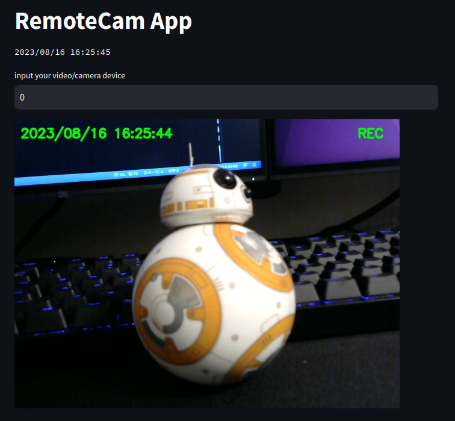

# remote-cam-app

Use Streamlit and your webcam to stream and record on websites.



## Installation

```
git clone https://github.com/tomcat930/remote-cam-app.git
cd remote-cam-app
pip install -r requirements.txt
```

## Usage

Enter the recording start and end time.

```
START_REC_TIME = {"H":8, "M":30, "S":0, "ms":0}
END_REC_TIME = {"H":9, "M":00, "S":0, "ms":0}
```

Launch the app.

```
streamlit run app.py
```